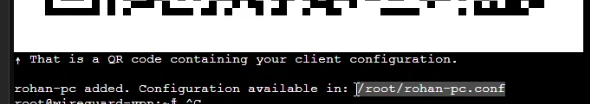
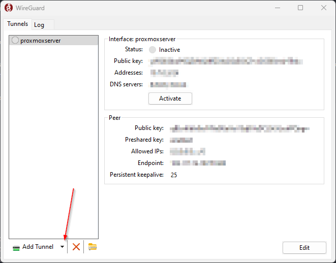
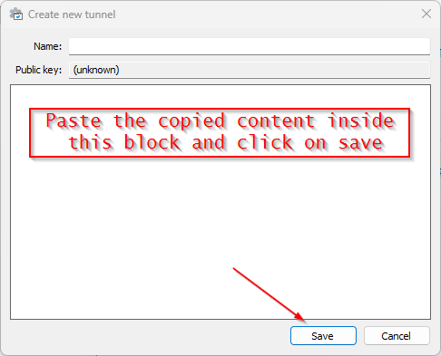

### Setup Wireguard VPN on proxmox inside LXC Container

1. First you need to setup a container on proxmox, it is suggested to use ubuntu
2. After creating container login to the container and update it 
```
apt update && apt upgrade -y
```
3. After container is created, you need to edit the configuration file to add the /dev/net/tun device.
```
nano /etc/pve/lxc/101.conf
```
4. Add the following lines at the end (if you're using PVE < 7.0, change `cgroup2` with `cgroup`)
```
 lxc.cgroup2.devices.allow: c 10:200 rwm
 lxc.mount.entry: /dev/net dev/net none bind,create=dir
 ```
 Press Ctrl-X and answer "Y" for saving and press Enter.
5. For your unprivileged container to be able to access the /dev/net/tun from your host, you need to set the owner by running:
```
chown 100000:100000 /dev/net/tun
```
6. Check the permissions are set correctly: this is optional but recommended
```
ls -l /dev/net/tun
crw-rw-rw- 1 100000 100000 10, 200 Dec 22 13:26 /dev/net/tun
```
7. Finally start the container
```
pct start 101
```
8. After updating install wireguard in the container by using below command - Github for wireguard https://github.com/Nyr/wireguard-install
```
wget https://git.io/wireguard -O wireguard-install.sh && bash wireguard-install.s
```
9. Confirm your IP during the setup 
10. Confirm port : It is recommended to change the port
11. Confrim client name :
12. It will generate token Screenshot that token and use it to setup in your mobile phone (PC does not support bar code scanning)
13. To enroll pc you need to see config file that is generated during the setup : cat /root/<your client name>.conf and copy the content of the file

14. To connect with PC you need to download wireguard client 
15. Open Wireguard Client and Click on Add Tunnel >> Create Empty tunnel

16. Name it something to remember and paste that content inside this 

